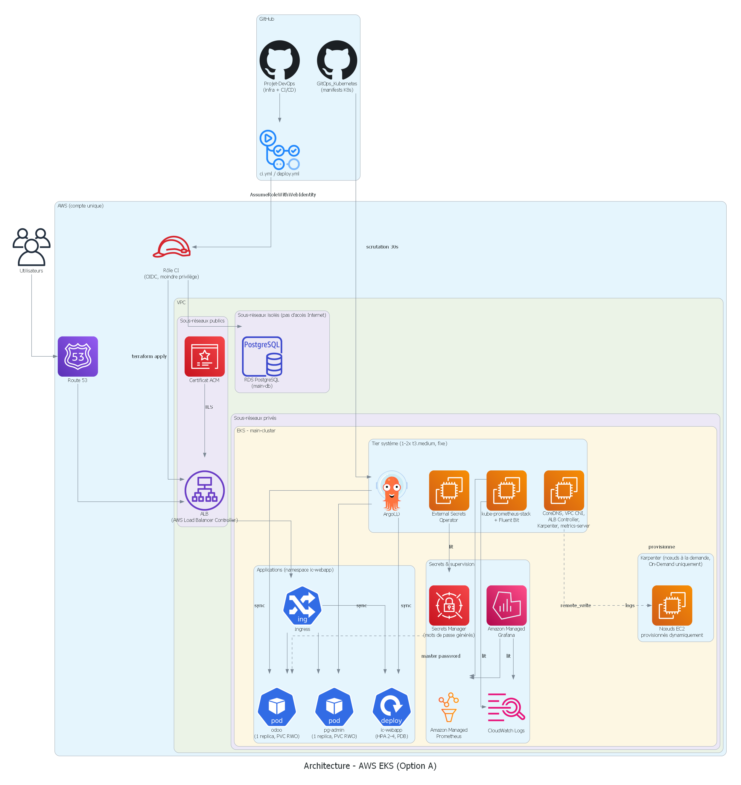

[](https://github.com/LoicPierret/Projet-DevOps/actions/workflows/ci.yml)
[](https://github.com/LoicPierret/Projet-DevOps/actions/workflows/deploy.yml)

# 🌐 Projet DevOps hybride : Cloud-Native (AWS EKS) & On-Premise

## 📝 Présentation du projet

Ce projet démontre un cycle de vie DevOps complet à travers une approche **hybride** : la même stack applicative (ERP Odoo, PostgreSQL, une webapp de portail `ic-webapp`, et pgAdmin) peut être déployée sur deux environnements différents :

1. **Option A — Cloud-Native** : infrastructure managée sur **AWS EKS**, pilotée par Terraform, GitOps (ArgoCD) et GitHub Actions. C'est l'option documentée en détail dans ce README — l'essentiel du travail de ce projet.
2. **Option B — On-Premise** : infrastructure traditionnelle sur serveurs Linux, configurée via **Ansible** et **Jenkins** (`ansible/`, `Jenkinsfile`).

L'objectif de l'option A est de montrer une maîtrise réaliste de l'ingénierie cloud/DevOps moderne : Infrastructure as Code, GitOps, sécurité par moindre privilège, CI/CD, et supervision — avec une attention particulière portée aux **compromis documentés** plutôt qu'aux raccourcis silencieux.

---

## 🏗️ Architecture (Option A)



<sub>Généré avec la librairie Python [`diagrams`](https://diagrams.mingrammer.com/) — script source dans `docs/generate_architecture.py` (régénérer avec `python docs/generate_architecture.py`, nécessite Graphviz).</sub>

Flux CI/CD (au-dessus du schéma d'infrastructure) :

```
GitHub (LoicPierret/Projet-DevOps)          GitHub (LoicPierret/GitOps_Kubernetes, public)
  │                                            │
  │ push/merge sur main                        │ lu en continu par ArgoCD (scrutation 30s)
  ▼                                            ▼
┌─────────────────────────┐           ┌──────────────────────────┐
│ ci.yml (PR + push main) │           │ apps/*  (manifests K8s)  │
│ - build/scan/test Docker│           │ bootstrap/* (Application)│
│ - terraform plan (app)  │           └──────────────────────────┘
└─────────────────────────┘                         ▲
  │ déclenche (workflow_run)                        │ synchronise
  ▼                                                 │
┌───────────────────────────────────────────────────────────────┐
│ deploy.yml                                                    │
│  check-ci → docker-push → [approbation manuelle] → update-    │
│  gitops (commit tag SHA) + plan/deploy (terraform apply infra)│
└───────────────────────────────────────────────────────────────┘
```

### AWS — deux stacks Terraform séparés

| Stack | State | Contenu | Qui l'applique |
|---|---|---|---|
| `terraform/bootstrap` | Local (`terraform.tfstate` dans le dossier) | Bucket S3 + DynamoDB (backend du state de `app`), rôle IAM OIDC pour GitHub Actions, zone Route 53, certificat ACM (référencé) | Manuellement, avec un accès admin |
| `terraform/app` | S3 (backend créé par `bootstrap`) | VPC, EKS, RDS, ArgoCD, contrôleur ALB, ExternalDNS, External Secrets Operator, supervision (AMP/AMG/Fluent Bit) | CI (`deploy.yml`) ou manuellement |

**Pourquoi séparés** : `bootstrap` contient ce qui doit **survivre** aux cycles de destruction/recréation de `app` (state, zone DNS dont les serveurs de noms sont déclarés chez le registrar, rôle CI) — le détruire obligerait à tout reconfigurer. `app` contient l'infra applicative, recréée régulièrement pour maîtriser les coûts.

### Composants du stack `app`

- **Réseau** (`modules/vpc`) : VPC dédié, sous-réseaux publics (ALB), privés (nœuds EKS), et **isolés** (RDS — aucune route vers Internet, ni IGW ni NAT).
- **EKS** (`modules/eks`) : cluster managé, un tier "système" à taille fixe et réduite (1 nœud `t3.medium`, marge à 2 pour les rolling updates) hébergeant les composants de plateforme, prefix delegation activé sur le CNI (densité de pods), `max-pods` explicite via `nodeadm` (AL2023).
- **Autoscaling** : **Karpenter** (nœuds) provisionne à la demande la capacité EC2 manquante au-delà du tier système, en On-Demand uniquement (voir *Choix d'architecture*) ; **HorizontalPodAutoscaler** (pods, `ic-webapp` uniquement) + **PodDisruptionBudget** associé.
- **RDS** (`modules/rds`) : PostgreSQL, mot de passe généré par Terraform (voir *Choix d'architecture*).
- **DNS/TLS** : zone Route 53 et certificat ACM créés dans `bootstrap` (`modules/route53`, `modules/certificate`), enregistrements applicatifs gérés automatiquement par **ExternalDNS**.
- **Ingress** : AWS Load Balancer Controller (un seul ALB pour les 3 applications).
- **GitOps** : **ArgoCD**, motif *app of apps* — une `Application` racine (créée par Terraform via un mini chart Helm local) découvre les autres dans le dépôt [`GitOps_Kubernetes`](https://github.com/LoicPierret/GitOps_Kubernetes) (public).
- **Secrets** : **External Secrets Operator**, synchronise des secrets générés par Terraform et stockés dans **AWS Secrets Manager** vers des Secrets Kubernetes — aucun secret n'est jamais commité dans Git.
- **Supervision** (`modules/observability`) : **Amazon Managed Prometheus** (métriques, via `kube-prometheus-stack` en relais sans stockage persistant) + **Amazon Managed Grafana** (visualisation, authentification IAM Identity Center) + **Fluent Bit** → CloudWatch Logs (logs applicatifs).

### CI/CD

- **`ci.yml`** : build/scan (Snyk)/test de l'image Docker + `terraform plan` sur `app` + **scan de sécurité statique Terraform (tfsec)** sur l'ensemble du code (`bootstrap`, `app`, `modules`) — sur chaque PR vers `main`, et sur chaque push sur `main` (revalide l'état réellement mergé).
- **`deploy.yml`** : se déclenche automatiquement après un `ci.yml` réussi sur `main`. Construit l'image avec un tag **immuable** (SHA du commit), puis **s'arrête et attend une approbation manuelle** (environment GitHub `production`) avant de : committer le nouveau tag dans le dépôt GitOps (déclenchant ArgoCD), et appliquer les changements d'infrastructure Terraform. La CI verte seule ne déploie donc jamais rien.

---

## 🚀 Lancer le projet

### Prérequis

- Un compte AWS avec **IAM Identity Center** activé (utilisé pour l'accès Grafana et, en général, l'accès SSO au compte).
- Un domaine sous ta gestion (ce projet utilise Route 53 comme registrar).
- Outils locaux : Terraform ≥ 1.5, AWS CLI, `kubectl`.
- Un compte Docker Hub (pour héberger l'image `ic-webapp`).
- Un compte [Snyk](https://snyk.io) (scan de vulnérabilités, gratuit en usage limité).
- Deux dépôts GitHub : celui-ci (infra) et un second, **public**, pour le GitOps (exemple : [`GitOps_Kubernetes`](https://github.com/LoicPierret/GitOps_Kubernetes)).

### 1. Bootstrap (une seule fois, avec un accès AWS admin)

```bash
cd terraform/bootstrap
```

Adapte `variables.tf` (ou passe des `-var`) à ton contexte :
- `github_org` / `github_repo` : **le dépôt GitHub qui exécutera la CI** .
- `domain_name` : ton nom de domaine.
- `state_bucket_name` : doit être globalement unique.

```bash
terraform init
terraform plan
terraform apply
```

Récupère les sorties utiles :
```bash
terraform output github_actions_role_arn     # -> secret AWS_IAM_ROLE_ARN
terraform output route53_name_servers        # -> à déclarer chez ton registrar
```

**Action manuelle** : configure les 4 NS retournés chez ton registrar de domaine (Route 53 → Registered domains, ou l'interface de ton registrar externe). Sans ça, la validation du certificat ACM du stack `app` restera bloquée indéfiniment.

### 2. Secrets et configuration GitHub

Dans **Settings → Secrets and variables → Actions** du dépôt :

| Secret | Description |
|---|---|
| `AWS_IAM_ROLE_ARN` | Sortie `github_actions_role_arn` du bootstrap |
| `DOCKERHUB_PASSWORD` | Jeton d'accès Docker Hub |
| `SNYK_TOKEN` | Jeton API Snyk |
| `GITOPS_PUSH_TOKEN` | Personal Access Token GitHub, **Contents: Read and write**, scopé uniquement au dépôt GitOps |

Dans **Settings → Environments**, crée un environment `production` et active **Required reviewers** — c'est la porte d'approbation manuelle avant tout déploiement réel.

### 3. Dépôt GitOps

Crée un dépôt public séparé et reprends la structure de [`GitOps_Kubernetes`](https://github.com/LoicPierret/GitOps_Kubernetes) (`bootstrap/` = les `Application` ArgoCD, `apps/<nom>/` = les manifests Kustomize par application). Mets à jour `gitops_repo_url` dans `terraform/app/variables.tf` si tu utilises un autre dépôt.

### 4. Stack applicatif

Premier apply, manuel (pour éviter de dépendre d'une CI pas encore testée) :
```bash
cd terraform/app
terraform init
terraform apply
```

Les applies suivants peuvent passer par `deploy.yml` 

### 5. Étapes manuelles post-apply (à refaire à chaque recréation complète du stack `app`)

Ces étapes ne sont **pas automatisées volontairement** (voir *Problèmes rencontrés* pour le pourquoi) :

1. **Sources de données Grafana** : dans l'UI Grafana (URL donnée par `aws grafana describe-workspace`), ajoute manuellement les sources **Prometheus** (endpoint du workspace AMP, authentification SigV4, champ *Assume Role ARN* laissé **vide**) et **CloudWatch** (région, log group `/eks/<cluster>/application`).
2. **Accès admin Grafana** : dans IAM Identity Center → Applications → le workspace Grafana → assigne ton utilisateur avec le rôle Admin.

### 6. Réduire les coûts entre deux sessions de travail

```bash
# Nettoyer les ressources créées hors Terraform (ALB, volumes EBS) avant de détruire :
kubectl delete application root -n argocd   # cascade : Ingress, PVC, Deployments

cd terraform/app
terraform destroy   # jamais bootstrap/ (state, DNS, rôle CI à préserver)
```

---

## 🐛 Problèmes rencontrés (et comment ils ont été résolus)

Ce projet a été construit avec un principe constant : **diagnostiquer avec des données réelles avant de corriger**, plutôt que d'empiler des suppositions. Voici les principaux obstacles rencontrés — de bons points de discussion technique.

### Bootstrap EKS : conflits au premier démarrage

- **Log group CloudWatch déjà existant** : une tentative d'apply précédente avait laissé un log group non suivi par le state → `ResourceAlreadyExistsException`. Résolu en le supprimant avant de relancer.
- **Certificat ACM bloqué en `PENDING_VALIDATION`** : la zone Route 53 était saine, mais le domaine (acheté via Route 53 Domains) avait encore les NS d'une zone précédente, supprimée. Diagnostiqué en interrogeant directement `aws route53domains get-domain-detail`, corrigé en republiant les bons NS.
- **Version de moteur RDS introuvable** : `16.6` n'était plus listée par AWS au moment de l'apply — vérifié via `aws rds describe-db-engine-versions`, mis à jour vers une version actuellement disponible.
- **Grant KMS pas encore propagé** : la création du cluster EKS échouait avec `AccessDenied` sur la clé KMS, alors que la policy et les grants étaient corrects — un simple problème de propagation (délai de quelques minutes), confirmé en vérifiant `aws kms list-grants` puis résolu par un simple retry.

### Course entre le contrôleur ALB et d'autres composants

Plusieurs installations (l'addon `coredns`, ArgoCD, External Secrets, `kube-prometheus-stack`) créent des `Service` Kubernetes qui passent par le webhook de mutation du contrôleur ALB. Si ce contrôleur n'est pas encore prêt (ses pods démarrent après son installation Helm), ces créations échouent (`AdmissionRequestDenied`). Corrigé en ajoutant un `depends_on` explicite sur `helm_release.aws_load_balancer_controller` pour chaque composant concerné — Terraform ne garantit pas cet ordre tout seul.

### Créer un CRD et une instance de ce CRD dans le même apply

L'`Application` ArgoCD et le `ClusterSecretStore` d'External Secrets sont des ressources personnalisées (CRD), installées par le même apply que celui qui les utilise. Deux approches ont échoué avant la bonne :
- Le provider `alekc/kubectl` échoue au *plan* si le host du provider (dérivé d'un attribut du cluster) n'est pas encore connu.
- `kubernetes_manifest` valide le schéma au *plan*, avant que le CRD n'existe.

**Solution retenue** : un mini chart Helm **local** (`app/charts/argocd-bootstrap`, `app/charts/external-secrets-bootstrap`) qui ne fait que créer la ressource personnalisée — le provider `helm`, déjà fiable ailleurs dans le projet, gère correctement ce cas.

### Mot de passe RDS et External Secrets

`manage_master_user_password = true` (mot de passe géré nativement par AWS) semblait la meilleure pratique — mais AWS nomme le secret Secrets Manager résultant de façon imprévisible (`rds!db-<id>`, différent à chaque recréation de l'instance), et External Secrets Operator ne sait pas fiablement retrouver un secret par motif de nom **et** décomposer son JSON en même temps (vérifié empiriquement). Résolu en générant le mot de passe **avec Terraform**, sous un nom Secrets Manager fixe choisi à l'avance — perd la rotation automatique native, gagne une intégration GitOps sans dépendance à un identifiant imprévisible.

### Fluent Bit : deux bugs de configuration successifs

- `log_stream_prefix` vide refusé par le plugin CloudWatch (`log_stream_name or log_stream_prefix is required`).
- Le chart `aws-for-fluent-bit` embarque **deux** plugins de sortie CloudWatch distincts (`cloudWatch` et `cloudWatchLogs`, ce dernier activé par défaut) — sans désactiver explicitement le second, les logs partaient vers son log group par défaut, hors du périmètre IAM du rôle, provoquant un `AccessDeniedException` malgré une configuration apparemment correcte. Diagnostiqué en lisant directement la `ConfigMap` générée par le chart.

### `max-pods` figé au démarrage du nœud

Activer `ENABLE_PREFIX_DELEGATION` sur l'addon `vpc-cni` ne suffit pas : le nombre maximum de pods par nœud est un paramètre du kubelet, calculé **une seule fois** au démarrage à partir d'une table statique par type d'instance — il ignore l'état du CNI. Sur les nœuds AL2023 (notre AMI), la configuration passe par un document cloud-init `nodeadm` (`spec.kubelet.config.maxPods`), pas par l'ancien mécanisme `bootstrap_extra_args`/`--use-max-pods`, spécifique à AL2. Nécessite en plus un remplacement des nœuds existants pour prendre effet.

### Amazon Managed Grafana : deux bugs AWS, pas les nôtres

- `permission_type = "SERVICE_MANAGED"` est censé attacher automatiquement les droits IAM nécessaires — en pratique, aucune policy n'était réellement attachée (vérifié directement via `aws iam list-attached-role-policies`), causant des `403` sur toutes les requêtes Prometheus/CloudWatch depuis Grafana. Corrigé en attachant nous-mêmes les policies managées AWS officielles (`AmazonPrometheusQueryAccess`, `AmazonGrafanaCloudWatchAccess`).
- Associer un utilisateur SSO comme administrateur du workspace (`aws_grafana_role_association`) exige, côté rôle IAM exécutant Terraform, des droits **très larges** sur l'ensemble d'IAM Identity Center (`AWSSSODirectoryAdministrator` et équivalents, documentés par AWS) — aucune version scopée à un seul workspace n'existe. Donner ce niveau de droit à la CI aurait été disproportionné : cette association a été **volontairement retirée de la gestion Terraform automatisée**, à refaire manuellement (quelques clics) après chaque recréation complète du cluster.

### `for_each` sur une valeur encore inconnue (tags de découverte Karpenter)

Sur un premier apply après un destroy, `aws_ec2_tag.karpenter_discovery_subnet` utilisait `for_each = toset(module.vpc.private_subnets)` → `Invalid for_each argument` : le contenu du tuple des sous-réseaux n'est connu qu'à l'*apply*, alors que `for_each` doit connaître l'ensemble de ses clés dès le *plan*. Corrigé en indexant par position plutôt que par valeur (`for idx, subnet_id in module.vpc.private_subnets : idx => subnet_id`) — l'indice est connu dès le plan (dérivé de la longueur de `var.azs`), même si le contenu des sous-réseaux ne l'est pas encore.

### Droits IAM du rôle CI découverts au fil des premiers vrais applies

Plusieurs erreurs `AccessDenied` sont apparues uniquement lors des premières exécutions du rôle CI (jusque-là, tous les tests avaient été faits avec une session personnelle en accès admin) : le provider AWS lit systématiquement certains attributs optionnels au *refresh* (`secretsmanager:GetResourcePolicy`, `aps:DescribeLoggingConfiguration`, `grafana:DescribeWorkspaceConfiguration`...), même quand rien n'a jamais été configuré sur ces attributs. La policy du rôle CI (`bootstrap/oidc.tf`) a été affinée de façon **réactive**, permission par permission, plutôt que d'anticiper des droits non prouvés nécessaires — cohérent avec le principe de moindre privilège appliqué à l'ensemble du projet.

---

## 🧭 Choix d'architecture et compromis assumés

### Pourquoi deux stacks Terraform séparés (`bootstrap` / `app`)

`app` est détruit et recréé régulièrement pour maîtriser les coûts. Tout ce qui doit **survivre** à ces cycles (le state lui-même, la zone DNS — dont changer les serveurs de noms obligerait à reconfigurer le registrar à chaque fois —, le rôle IAM de la CI) vit dans `bootstrap`, appliqué séparément et rarement.

### Pourquoi les sous-réseaux RDS sont isolés

Aucune route vers Internet (ni IGW ni NAT) sur les sous-réseaux de base de données — RDS n'a jamais besoin de sortir vers Internet, et Kubernetes/RDS restent joignables entre eux via la route locale automatique du VPC, sans exception à ouvrir.

### Pourquoi un chart Helm local plutôt qu'un provider Terraform tiers pour les CRD

Voir *Problèmes rencontrés* ci-dessus — c'est le mécanisme le plus fiable trouvé, réutilisant un provider (`helm`) déjà éprouvé dans le projet plutôt que d'introduire une dépendance supplémentaire.

### Pourquoi un intervalle de scrutation ArgoCD réduit plutôt qu'un webhook GitHub

Un webhook GitHub → ArgoCD donnerait une synchronisation quasi instantanée, mais exigerait d'exposer publiquement `argocd-server` (resté volontairement en `ClusterIP`, accessible uniquement via `kubectl port-forward`). L'exposition supplémentaire n'a pas été jugée justifiée pour ce projet. Réduire `timeout.reconciliation` à 30 secondes donne le même bénéfice perçu sans rien exposer de nouveau.

### Pourquoi Amazon Managed Prometheus + Grafana plutôt que CloudWatch Container Insights

CloudWatch Container Insights aurait été plus simple et moins cher à mettre en place. Le choix d'AMP/AMG est assumé pour sa valeur de démonstration : PromQL et Grafana sont des compétences bien plus largement reconnues dans l'industrie que le langage de requête propriétaire de CloudWatch — un compromis coût/complexité contre valeur de portfolio, explicite plutôt que caché.

### Pourquoi `kube-prometheus-stack` plutôt qu'ADOT pour la collecte

AWS recommande officiellement ADOT (AWS Distro for OpenTelemetry) pour alimenter AMP. `kube-prometheus-stack` a été préféré : le chart le plus déployé et documenté de l'écosystème pour ce cas d'usage précis, avec un risque de configuration nettement plus faible qu'un CRD `OpenTelemetryCollector` écrit à la main — un choix de fiabilité plutôt que de suivre la recommandation "sur le papier".

### Pourquoi Fluent Bit et Prometheus restent deux agents séparés

Consolider logs et métriques dans un seul collecteur (ADOT) réduirait le nombre de composants en théorie — mais kube-state-metrics et node-exporter restent de toute façon nécessaires séparément quel que soit le collecteur choisi, et un agent unique partage un seul domaine de panne entre logs et métriques. Deux outils spécialisés, chacun dans son domaine, limitent le rayon d'explosion en cas d'erreur de configuration.

### Pourquoi le déploiement CI/CD attend une approbation manuelle

Le pipeline construit l'image et calcule le plan Terraform automatiquement après chaque succès de la CI — mais **s'arrête** avant d'appliquer quoi que ce soit en production (via l'environment GitHub `production`, protégé par *Required reviewers*). C'est le compromis *Continuous Delivery* plutôt que *Continuous Deployment* : automatisé jusqu'à la porte de la production, un humain décide de l'ouvrir.

### Pourquoi Karpenter plutôt que Cluster Autoscaler

Cluster Autoscaler aurait été plus simple à justifier a priori (moins de composants, pas de policy IAM sur mesure — c'était d'ailleurs le choix envisagé au départ). Karpenter a été retenu pour démontrer la maîtrise de l'outil aujourd'hui recommandé par AWS pour EKS : provisionnement direct via l'API EC2 (pas d'Auto Scaling Group intermédiaire), plus rapide et plus fin par type d'instance.

### Pourquoi pas de gestion des interruptions (SQS/EventBridge) pour Karpenter

Le modèle IAM officiel de Karpenter (repris du template CloudFormation de sa documentation) inclut des statements dédiés à une file SQS et des règles EventBridge, permettant de réagir proprement aux interruptions Spot. Volontairement exclus ici — conséquence directe : le NodePool par défaut est contraint aux instances **On-Demand uniquement**, jamais Spot, pour ne pas laisser des pods se faire couper sans préavis. Les rares récupérations d'instances On-Demand par AWS (maintenance matérielle) restent, elles, correctement absorbées par le contrôle-plane Kubernetes standard, sans nécessiter cette gestion.

### Pourquoi le HPA et le PodDisruptionBudget ne concernent que `ic-webapp`

`odoo` et `pgadmin` montent chacun un volume EBS (`ReadWriteOnce`) pour leurs données persistantes : un PVC de ce type ne peut être attaché qu'à un seul nœud à la fois, les rendant non scalables horizontalement par construction (et Odoo lui-même ne gère pas nativement le multi-instance sans stockage de fichiers partagé). Seul `ic-webapp`, sans état, s'y prête. Le plancher du HPA a été fixé à 2 replicas (pas 1) spécifiquement pour que le `PodDisruptionBudget` (`minAvailable: 1`) ait un sens réel : avec un seul replica, ce PDB bloquerait indéfiniment toute éviction volontaire, y compris les consolidations Karpenter.

---

## 🛡️ Sécurité

- **Moindre privilège partout** : le rôle IAM de la CI (`bootstrap/oidc.tf`) n'a que les droits strictement nécessaires, scopés par préfixe de nom de ressource quand c'est possible — construit et affiné de façon incrémentale au fil des besoins réels, jamais élargi par anticipation.
- **Aucun secret dans Git** : mots de passe RDS et pgAdmin générés par Terraform, stockés dans AWS Secrets Manager, synchronisés vers Kubernetes par External Secrets Operator.
- **OIDC plutôt que des clés d'accès longue durée** pour l'authentification GitHub Actions → AWS.
- **Approbation humaine obligatoire** avant tout déploiement en production.
- **Scan de vulnérabilités Snyk** sur chaque image Docker construite, et **scan de sécurité statique du code Terraform (tfsec)**, bloquant en CI.
- **Réseau** : RDS dans des sous-réseaux sans aucune sortie Internet ; aucun security group n'autorise `0.0.0.0/0` sur un port d'administration.
